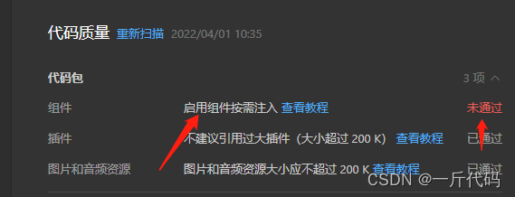

# 随手笔记

医疗项目

技术栈：uni-app

1、uniapp 小程序启用组件按需注入 “lazyCodeLoading“: “requiredComponents“

自基础库版本 2.11.1 起，小程序支持有选择地注入必要的代码，以降低小程序的启动时间和运行时内存 ------ [官方解答](https://developers.weixin.qq.com/miniprogram/dev/framework/ability/lazyload.html#%E7%94%A8%E6%97%B6%E6%B3%A8%E5%85%A5)
